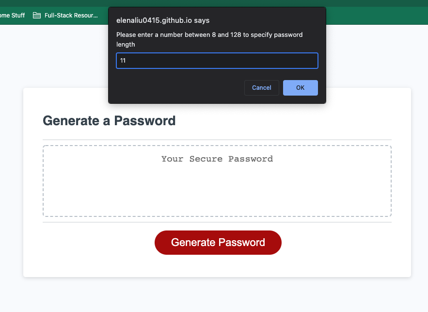
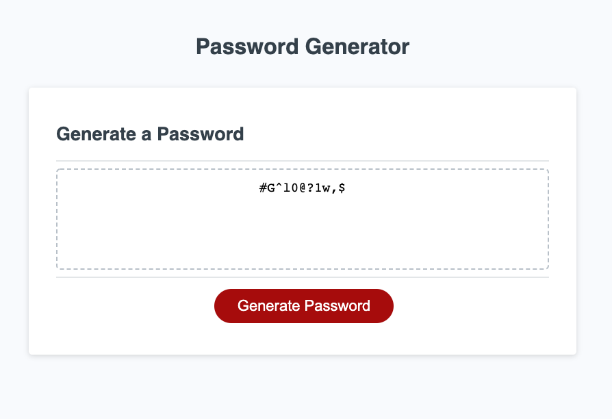

# Password Generator | HTML, CSS & JavaScript

## Description 
- This app will randomly generate a password that meets certain criteria so that a strong password will be created to provide greater security.
- The password length should be at least 8 and up to 128 characters 
- The user can select from four character types, which to be included in the password: 
    1. Lower case letters
    2. Uper case letters 
    3. Numbers 
    4. Special symbols 

## Credits 
Shout out to my fantastic study group teammates Erica and Ivo, I learned a lot from them. 

## Screenshot of the app 

## Deployed link to the app

https://elenaliu0415.github.io/password-generator/
